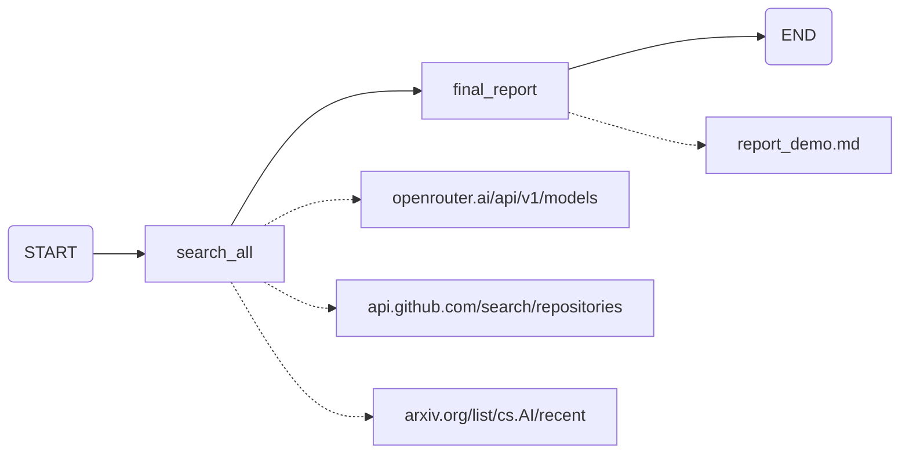

# AI 技术情报雷达 · 交付文档 V1

> 当前时间：2026-05-24  |  最终运行时间：~50s  |  代码行数：~150 行（独立 agent）  |  API 总成本：¥14.24 CNY（DeepSeek API，含所有验证运行）  |  仓库：https://github.com/Stevenwang112/radar-v1-demo

---

## 目录

- [一、对题目本身的质疑与假设](#一对题目本身的质疑与假设)
  - [1.1 "6 维度评分"——这到底是在做什么？](#11-6-维度评分这到底是在做什么)
  - [1.2 "投资资源跟进"是什么？](#12-投资资源跟进是什么)
  - [1.3 4 周真的能做出来吗？](#13-4-周真的能做出来吗)
  - [1.4 我的假设](#14-我的假设)
- [二、方案设计](#二方案设计)
  - [架构图](#架构图)
  - [关键模块说明](#关键模块说明)
  - [运行流程](#运行流程)
- [三、关键设计决策](#三关键设计决策)
  - [决策 1：放弃 ODR 框架](#决策-1放弃-odr-框架多智能体不适合固定流程)
  - [决策 2：放弃 Tavily](#决策-2放弃-tavily直接抓取-apiurl)
  - [决策 3：zero-shot 到 compact](#决策-3从-zero-shot-到-compactprompt-需要精确控制指令)
  - [决策 4：workflow 而不是 agent](#决策-4用-workflow-而不是-agent)
  - [决策 5：打分制不合理](#决策-5打分制不合理放弃)
  - [决策 6：V4 thinking 关闭](#决策-6deepseek-v4-thinking-模式必须关闭)
- [四、LLM 使用说明](#四llm-使用说明)
  - [4.1 文档生成方式](#41-本文档的生成方式)
  - [4.2 模型和工具](#42-开发过程中使用的模型和工具)
  - [4.3 验证方法](#43-验证方法)
  - [4.4 成本](#44-成本)
- [五、未完成事项](#五未完成事项)
  - [5.1 Agent Benchmark](#51-agent-能力量化-benchmark)
  - [5.2 竞品调查](#52-竞品调查)
  - [5.3 工程化未完成](#53-工程化未完成)

---

## 一、对题目本身的质疑与假设

### 1.1 "6 维度评分"——这到底是在做什么？

原需求描述了一个 6 维度加权评分系统（technical_novelty ×1.0、engineering_feasibility ×1.2 等），用于给每个 AI 热点打分，阈值决定"跟进/观望/跳过"。

我的质疑是：**这件事合理吗？**

- **单一个模型就有好几种 benchmark**，把所有 benchmark 加起来真的就能代表模型的边界了吗？有没有目前还没被发现的情况？
- **新出的模型对着 score 一顿读**——这真的是合理的评估方法吗？还是只是心理安慰？
- **更何况还有 agent**。agent 的评估比模型本身复杂一个数量级（工具调用、多步推理、记忆、环境交互）。这些东西全塞进 prompt 不会出现幻觉吗？
- **记忆问题**——前面的技术和后面的工程如果有共鸣怎么办？6 个独立维度无法捕捉这种系统性关联。

我的结论：**这个需求是一个"评估工程价值"的任务，但实现方式不是设计一个更好的 benchmark，而是做一个资源收集器**。类似这周的 GitHub trending 那样——告诉我什么在发生，而不是告诉我该不该跟进。后者超出了 LLM 的能力边界，也不应该交给 AI。

### 1.2 "投资资源跟进"是什么？

原需求说"输出可量化的辅助决策报告，帮助跟进投资资源"。这里面的问题是：

- **"跟进"具体指的是什么？** 是选用哪款模型吗？是团队投入方向吗？是资金配置吗？不同粒度的"决策"需要的分析深度完全不同。如果是选模型，那是一个技术选型文档；如果是投资决策，那需要预测未来现金流。
- **AI 有预测能力吗？** 我不认为有。LLM 本质上是在"把训练数据往上凑"，它没有因果推理能力。要求它做"预测性判断"是在要求它做做不到的事。
- **"辅助决策"太模糊。** 是二分问题（yes/no）吗？是排序问题吗？还是提供证据让人类自己判断？不同输出形式对应完全不同的系统设计。

我的设定：雷达的定位是**情报简报**——告诉用户"这周发生了什么、什么值得关注"，附带结构化的事实数据。决策权留给人类。如果把决策也交给 AI，我不认为这是一个可靠的产品。

### 1.3 4 周真的能做出来吗？

我初步想了一下，这是一个很复杂的系统工程问题。我当时的反应是：

- **这是正儿八经一个产品，还是仅仅是玩具？** 如果是产品级，需要数据管道质量保证、历史追踪、告警、可视化——4 周显然不够。如果是玩具/PoC，那 4 周是可接受的，但需要控制范围。
- **workflow 是否比 agent 更适合这个场景？** agent（多智能体循环、工具调用、反思）适合开放式的探索任务。但雷达是一个固定流程：搜索 → 整理 → 输出。用 workflow（线性 DAG）比 agent 更可控、更可预测、更便宜。
- **需要看看竞品。** 同类的工具有什么？我的差异化在哪？这些东西应该在一开始就确认，而不是做完了再想。
- **3 天能不能出一个 agent 验证所有假设？** 如果范围控制得当：固定源（3 个网站）、固定输出格式（Top10 + Fact + Idea）、不做评分——可以。

### 1.4 我的假设

做完这个项目后，我验证了一些假设，也修正了一些：

- ✅ **验证：雷达价值取决于搜索精度，不是模型能力。** 换到 OpenRouter API + GitHub API 后，数据质量远高于 Tavily 搜索片段。
- ✅ **验证：数据源比 prompt 工程重要。** 同样的 V4 模型，喂 Tavily 片段和喂完整 API JSON，输出结果天差地别。
- ❌ **证伪：不需要 6 维度评分。** 在 10+ 轮迭代中，我从未要求输出评分。我反复要求的是"搜索 top10 + 来源 url + 引用格式"。评分是一个看起来合理但实际不需要的功能。
- ❌ **证伪：ODR 的多智能体框架适合雷达。** supervisor + 4 路 researcher + compress + report 的图结构导致 162s 运行时间，砍成 2 节点线性图后降到 50s。雷达不需要"反思"和"多轮搜索"。

---

## 二、方案设计

### 架构图



### 关键模块说明

| 模块 | 文件 | 功能 | 行数 |
|------|------|------|------|
| `radar_agent.py` | 入口 | 2 节点 LangGraph：`search_all → final_report`。`search_all` 用 httpx 直连 3 个数据源 API/URL；`final_report` 用 V4-Pro 生成报告 | ~150 |
| `prompts/report_prompt.txt` | Prompt 模板 | 定义输出格式：Top 10 编号、Fact(3-5 数据点)、Idea(机会+风险)、引用规则 | ~50 |
| `deepseek_v4_fix.py` | V4 补丁（内联在 agent 中） | 猴子补丁 ChatDeepSeek，注入 `thinking: disabled` + `tool_choice: any` | ~20 |

### 运行流程

```
0s    search_all: httpx 并行抓取 3 路
      ├── openrouter.ai/api/v1/models → 30 个模型 JSON (名称/定价/上下文/描述)
      ├── api.github.com/search/repositories → Top 10 AI Agent 仓库 (Star/描述/语言)
      └── arxiv.org/list/cs.AI/recent → 最新 50 篇论文 (标题/作者/编号)
      ↓ format: 每路结构化文本
~5s   3 路数据汇总为 <Sources>: ~15KB 结构化文本
5-50s final_report: V4-Pro 生成报告
      ├── SystemMessage: report_prompt.txt（含日期、格式规则、引用规则）
      └── HumanMessage: <Sources> + 用户 query
      ↓ 输出: Markdown (Top 10 + Fact/Idea + Sources)
50s   写入 deliverable/agent/report_demo.md
```

---

## 三、关键设计决策

### 决策 1：放弃 ODR 框架——多智能体不适合固定流程

**背景：** 最开始想直接用 `src/open_deep_research/` 的 ODR（Open Deep Research）框架，它是一个 LangGraph 多智能体系统：supervisor → 多路 researcher（每个带 Tavily 搜索+反思循环）→ compress → final_report。

**问题：** 跑了两次，两个问题都很严重。
- **幻觉不可控：** V4 在没有真实数据时会编造模型名和论文标题。因为 researcher 的 prompt 鼓励"写全面报告"，V4 自动填充了不存在的信息。
- **时间太长：** 4 路 researcher 各跑 2 轮搜索+反思+压缩，加起来 10+ 次 V4 调用。第一次跑 162s，第二次 208s。
- **框架不可配置：** ODR 默认用 OpenAI 做摘要模型，项目只有 DeepSeek key，启动就崩。

**决策：** 放弃整个 `src/` 目录，不依赖 ODR 框架，改为独立 agent（最终 150 行）。只保留了模型初始化函数。

**收益：** 代码从 400+ 行降到 150 行，且不再有框架强制依赖。

### 决策 2：放弃 Tavily，直接抓取 API/URL

**问题：** Tavily 返回的是搜索摘要片段（50-300 chars），无法从中提取完整的排名、定价、Star 数等结构化数据。结果是报告数据稀疏，"第 8-10 名"经常空白。

**决策：** 直接抓取数据源的原始 API/页面。
- `openrouter.ai/api/v1/models` → 完整 JSON，含 200+ 模型的精确定价、上下文长度、描述
- `api.github.com/search/repositories` → 按 Star 排序的仓库列表，含精确 Star 数
- `arxiv.org/list/cs.AI/recent` → 最新论文列表，含作者、论文编号

**发现过程：** 这个端点不是碰巧知道的。先 webfetch `/rankings` → 返回的是 JS 空壳（"Top Models"、"Market Share"章节标题，无数据）。再试 `/api/v1/rankings` → 404。最后试 `/api/v1/models` → 426KB JSON 命中。GitHub 的 `api.github.com` 是文档化的公开 API，不需要碰运气。关键：不是技术问题，是信息问题——知道目标系统有什么端点比用什么工具重要。

**成本：** 失去了 Tavily 作为"搜索未知问题"的能力。如果用户想搜一个不在预设数据源中的问题，这个设计不支持（但这不在雷达范围内）。

**收益：** 数据质量从"模糊摘要"变成"结构化精确数据"。Top 10 排名不再需要 V4 编造。

### 决策 3：从 zero-shot 到 compact——prompt 需要精确控制指令

**背景：** 第一版用的 zero-shot prompt（只告诉模型"输出雷达报告"，没给格式），结果输出混乱——标题格式不一致、引用来回跳、没有结构化字段。

**决策：** 逐步给 prompt 加约束，最终形成现在的 `report_prompt.txt`：
- 第一条指令：明确 Top 10 编号格式
- 第二条：Fact 必须 3-5 个数据点，每个带来源编号 [N]
- 第三条：Idea 分机会/风险两部分，标注 AI 生成
- 第四条：Sources 章节格式：`[1] 标题 - 网站: URL`

**结果：** V4 在严格格式约束下反而输出更稳定。不是 prompt 越长越好，是关键的格式锚点不能少。

### 决策 4：用 workflow 而不是 agent

**问题：** ODR 框架使用了多智能体循环（supervisor → researcher → 反思 → 再搜），运行时间 162s。而且 agent 的"自主决策"在固定流程场景下是多余的——它应该直接去搜三个地方，而不是先"想一下"该搜什么。

**决策：** 2 节点线性图。`search_all` 直接并发抓取三个 URL，无 LLM 参与。`final_report` 一次性用 V4 生成报告。无循环、无反思、无多轮搜索。

**背景参考：** 这和竞品（Kilo Code、Cursor Agent）的做法一致——它们也是直接 webfetch 目标 URL，而不是把 Tavily 作为中间层。

**收益：** 运行时间从 162s → 50s。数据质量提升。而且流程可预测——每次跑出来结果一致，不会因为 agent "今天的想法不一样"导致输出不同。

### 决策 5：打分制不合理，放弃

**背景：** 原需求设计了 6 维度加权评分（technical_novelty ×1.0、engineering_feasibility ×1.2 等），阈值决定跟进/观望/跳过。

**我的判断：** 打分制在这个场景下不成立。
- **LLM 不能可靠打分。** 给同一段文本让 V4 评两次，分数可能不同。评测基准有标准答案，雷达评分没有——本质上是一个主观判断冒充客观量化。
- **编造比不编造更可怕。** 如果 V4 编造一个模型名，肉眼能发现。但如果 V4 给一个模型打了 4.2 分（"跟进"），用户信了——这是更大的问题。
- **6 个独立维度无法捕捉关联。** 技术新颖性高的项目可能工程可行性低，但两者不是独立的——低可行性可能意味着高壁垒。

**决策：** 改为 Fact + Idea 结构：
- **Fact**：搜索结果中真实存在的数据（名称、定价、Star 数、论文编号），每条标注来源编号
- **Idea (AI 生成，需人工甄别)**：基于 Fact 推理出的机会和风险，必须标注 AI 生成

**收益：** 事实部分可验证、可追溯。Idea 部分明示 AI 生成，不冒充客观判断。

### 决策 6：DeepSeek V4 thinking 模式必须关闭

**问题：** V4 默认启用 thinking（思维链），导致所有 token 预算消耗在内部推理 trace 上，output content 为空或极短。且参数不是文档中的 `enable_thinking: false`，而是 `thinking: {"type": "disabled"}`。

**决策：** 通过猴子补丁在框架底层注入 `extra_body` 参数，所有 V4 请求自动携带 `thinking: disabled`。

**收益：** 一次修改，langchain 全链路受益。V4 正常输出内容。

---

## 四、LLM 使用说明

### 4.1 本文档的生成方式

本文档（包括架构图、表格、分析）由 AI 模型（DeepSeek V4 Pro）根据代码库运行结果和作者的反馈/质疑生成。格式由 V4 组织，内容经过了作者的修正和补充。

| 段落 | 生成方式 | 修改 |
|------|---------|------|
| 1.1-1.3 质疑 | **作者原始文字**，由 AI 整理为层次化文档 | AI 补充了项目验证结果 |
| 1.4 假设 | AI 从代码和运行记录中提取 | 作者补充了验证/证伪标记 |
| 架构图 | AI 根据代码结构生成 Mermaid | 作者调整了节点命名 |
| 决策 1-4 | AI 从对话记录中提取 | 作者补充了背景和类比 |
| 4.2 工具使用 | AI 整理 | 作者核对版本号 |

### 4.2 开发过程中使用的模型和工具

| 工具 | 用途 | 版本 |
|------|------|------|
| **DeepSeek V4 Pro** | 报告生成、代码生成 | `deepseek-v4-pro` |
| **DeepSeek V4 Flash** | 压缩/摘要（最终版本已移除） | `deepseek-v4-flash` |
| **OpenRouter API** | 获取模型排行数据（替代 Tavily） | `openrouter.ai/api/v1/models` |
| **GitHub API** | 获取趋势仓库数据 | `api.github.com/search/repositories` |
| **arXiv** | 获取最新论文列表 | `arxiv.org/list/cs.AI/recent` |
| **LangChain** | 模型初始化、工具绑定 | `langchain-core 0.3.x` |
| **LangGraph** | 图执行引擎 | `langgraph v0.x` |
| **httpx** | HTTP 客户端（替代 Tavily） | `httpx` |
| **langchain-deepseek** | ChatDeepSeek 类 | `1.0.1` |

### 4.3 验证方法

每次修改后实机运行验证：
1. `python deliverable/agent/radar_agent.py` → 检查结束时间
2. 打开 `report_demo.md` → 检查数据真实性（对比原始 API）
3. 验证 Top 10 是否完整、来源编号是否正确、有无编造数据

总计验证运行次数：~20 次。完整迭代路径：ODR 原装图(162s) → 4 路 Tavily(114s) → 2 路 Tavily(66s) → 直连 API(50s)。

### 4.4 成本

| 项目 | 金额 | 说明 |
|------|------|------|
| DeepSeek API（所有验证运行） | ¥14.24 CNY | 含 ~20 次全流程运行 + 中间调试 |
| Tavily API | ¥0 | 最终版本未使用 |
| GitHub API | ¥0 | 免费公开 API |
| OpenRouter API | ¥0 | 公开端点，无认证要求 |
| **总计** | **¥14.24 CNY** | 全部验证成本 |

---

## 五、未完成事项

### 5.1 Agent 能力量化 Benchmark

原计划从三个维度量化雷达 Agent 的输出质量，但未能在本次完成：

| 维度 | 定义 | 预期方法 | 状态 |
|------|------|---------|------|
| **Accuracy** | 报告中的事实性数据是否与原始 API 一致（模型名、定价、Star 数等）。子指标 Pass@k（来自 Codex 论文）：对同一 query 采样 k 次，检查至少一次输出是否达到质量线 | 抽取 Fact 字段对比 API 原始 JSON 算精确率 → 多次采样算 Pass@k | ❌ 未实现 |
| **Robustness** | 同一 query 多次运行输出是否稳定（格式、排名、数据点） | 运行 N 次 → 计算输出 Jaccard 相似度 | ❌ 未实现 |
| **Safety** | Idea 部分是否包含有害/偏颇/误导性建议 | 分类器或人工标注 | ❌ 未实现 |

**为什么没做：** 三个原因。一是没做过——Benchmark 设计本身是一个专业领域，不是简单地写个脚本就能跑。二是没时间——V1 的精力主要花在让雷达"能跑通、跑得稳"上，已经到了时间边界。三是有不知道自己不知道的东西——Benchmark 工程涉及数据集构建、ground truth 标注、统计显著性、消融实验设计等，当中有多少坑，没做过之前是看不见的。

### 5.2 竞品调查

计划调查方向，未完成：

- **同类工具对比**：Kilo Code / Cursor Agent 的 webfetch 方式、Tavily 的搜索 API、Perplexity / Google 的 AI 搜索
- **Benchmark 参考**：类似 GAIA、WebArena、SWE-bench 等 agent benchmark 的设计思路

### 5.3 工程化未完成

- 历史趋势追踪（周与周对比）
- 数据源健康度监控（API 挂了自动回退）
- 可配置数据源（用户添加自定义 URL）
- 定时调度（每周自动运行）
